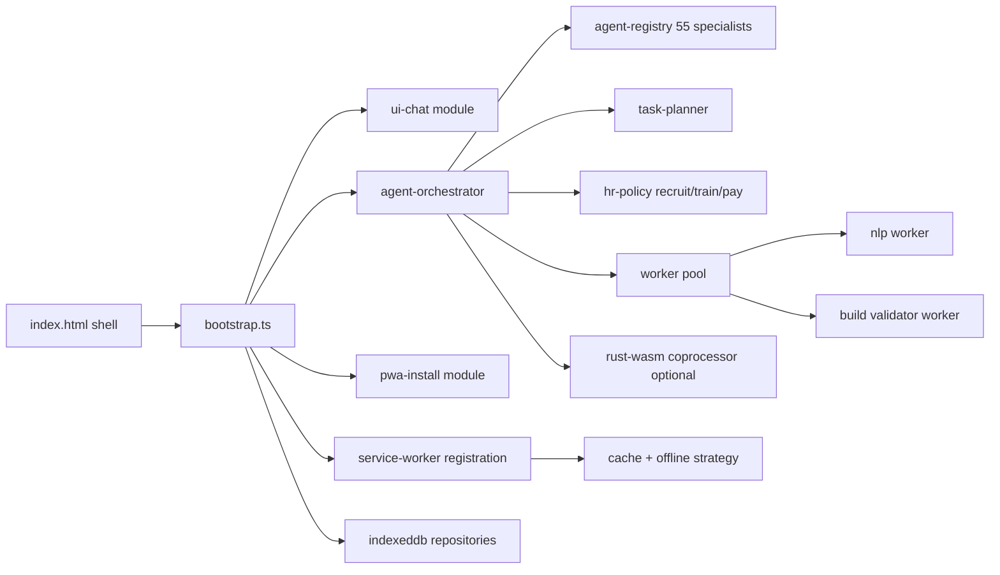

# QhySync AI Language Strategy White Paper v2
**Date:** April 1, 2026 (UTC)  
**Scope:** Offline-first, modular, production-grade AI chat + AI agency PWA with 55 specialist agents

---

## Abstract

This white paper evaluates the best implementation language strategy for the QhySync AI web platform, starting from your three original options (JavaScript, TypeScript/TSX, HTML+inline JS) and extending to additional modern candidates (ReScript, Kotlin/JS, Rust+WebAssembly, and Dart web). The analysis uses standards documentation and empirical software-engineering research to minimize assumption risk. 

**Primary conclusion:** TypeScript remains the best default language for the core application architecture, with modular HTML/CSS and ES modules. For performance-critical subsystems only, a **selective Rust/WASM coprocessor approach** can be considered.

---

## 1) Research Question

You asked:
1. Which is best among JS, TS/TSX, or HTML with inline JS?
2. Is there a better language beyond those three for a large, robust, non-monolithic offline-first PWA?

The target product is a browser-native autonomous AI platform with:
- orchestration of 55 specialists,
- HR-style role assignment logic,
- task planning and delegation,
- offline operation,
- install prompt flows across major browsers,
- long-term maintainability as file count scales.

---

## 2) Methods and Evidence Criteria

We prioritized:
- **Primary standards sources** (MDN, web.dev, official language docs)
- **Primary research papers** (ICSE/arXiv empirical software studies)
- Browser behavior documentation that is stable enough to guide architecture decisions

We avoided making cross-browser claims without source-backed caveats.

---

## 3) Baseline: Your Original Three Options

### 3.1 JavaScript (JS)

**Advantages**
- Fastest startup and lowest tooling overhead.
- Native runtime in every browser.

**Limitations at your scale**
- Lower refactor safety and interface guarantees across many modules.
- Defect discovery shifts toward runtime/testing instead of compile-time feedback.

**Assessment:** good for rapid prototype, weaker for long-lived agency-scale platform.

---

### 3.2 TypeScript / TSX / TS

TypeScript states it is “JavaScript with syntax for types” and emphasizes better tooling “at any scale.” It also supports gradual adoption and compiles back to JavaScript.  

Empirical bug research:
- Gao et al. (ICSE) found static typing tools detect a meaningful share of real JavaScript bugs (around 15% in their evaluated corpus).
- A 2026 TypeScript ecosystem study reports reduced classical runtime/type faults, while integration/toolchain faults become relatively more prominent in larger projects.

**Implication:** TS helps exactly where your system is vulnerable (multi-module interface drift), but you still need build discipline and dependency governance.

**Assessment:** strongest baseline choice for this project.

---

### 3.3 HTML with inline JS + separate CSS

**Advantages**
- Very simple for tiny pages.

**Limitations for this project**
- Encourages coupling of UI structure and logic.
- Harder module boundaries and testability.
- Higher monolithic risk as features expand.

**Assessment:** not suitable as the dominant approach for your architecture.

---

## 4) PWA Constraints You Must Design Around (Verified)

### 4.1 Installation prompt behavior is not uniform
web.dev explicitly cautions that `beforeinstallprompt` is not supported by all browsers and moved out of the main manifest spec path. MDN similarly marks the event as limited availability.

**Engineering consequence:** implement install as capability detection + fallback instructions, not as a guaranteed prompt flow.

### 4.2 Installability requirements matter
MDN documents installability prerequisites including manifest presence and HTTPS/localhost serving model. Chromium-specific manifest member expectations are also documented.

**Engineering consequence:** your install UX quality depends as much on standards compliance as on language choice.

### 4.3 Offline-first foundation
Service Worker architecture is the standards-based mechanism for cache/offline control.

**Engineering consequence:** language selection should optimize maintainability around service worker caching policy, sync logic, and storage migrations.

---

## 5) Extended Deep Research: Additional Language Options

## 5.1 ReScript

ReScript positions itself as a fully typed language compiling to readable JavaScript, highlighting fast builds and gradual adoption with JS ecosystem interoperability.

**Strengths for QhySync**
- Strong typing and predictable compile output.
- Good interop with existing JS ecosystem.

**Risks**
- Smaller hiring/community ecosystem than TS.
- More niche operational knowledge for long-term team scaling.

**Verdict:** credible niche alternative; still higher delivery risk than TS for broad web platform teams.

---

## 5.2 Kotlin/JS (Kotlin Multiplatform path)

Official Kotlin docs describe Kotlin/JS as transpiling Kotlin + dependencies to JavaScript, with use cases emphasizing shared logic between web/mobile/backend and npm/module-system interop.

**Strengths**
- Strong option if your broader stack is already Kotlin-first.
- Cross-platform domain model reuse can reduce duplication.

**Risks for your context**
- Added build/tooling surface vs TypeScript-first web stack.
- Frontend talent availability may be lower relative to TS.

**Verdict:** strategic only if you intentionally commit to Kotlin multiplatform as company-wide architecture.

---

## 5.3 Rust + WebAssembly (selective acceleration path)

The Rust/WASM book positions this combination for “fast, reliable code on the Web.”

**Strengths**
- Excellent for CPU-heavy kernels (e.g., ranking/planning/math-heavy inference helpers).
- Strong memory and safety model.

**Risks for your app type**
- Complexity overhead for web integration workflows.
- DOM/UI-heavy logic still sits naturally in JS/TS layers.
- Rust/WASM book is no longer maintained (as noted on the book site), so teams need updated ecosystem diligence.

**Verdict:** best as **targeted coprocessor modules**, not as entire frontend app language.

---

## 5.4 Dart Web

Dart’s web platform docs support web-targeted workflows and tooling.

**Strengths**
- Productive language/tooling for teams already invested in Dart/Flutter ecosystem.

**Risks**
- For a standards-centric PWA with heavy direct web-platform integration, TS ecosystem fit is typically stronger.

**Verdict:** viable, but not a superior default over TS for your current stated architecture.

---

## 6) Decision Matrix (v2)

| Criterion | JS | TS | HTML+inline JS | ReScript | Kotlin/JS | Rust+WASM | Dart Web |
|---|---:|---:|---:|---:|---:|---:|---:|
| Refactor safety at 100+ files | 2 | **5** | 1 | 4 | 4 | 5 | 4 |
| Web ecosystem compatibility | **5** | **5** | 3 | 4 | 4 | 3 | 4 |
| Build complexity risk | **5** | 4 | 4 | 4 | 3 | 2 | 3 |
| Team hiring/onboarding risk | **5** | **5** | 4 | 3 | 3 | 3 | 3 |
| PWA install/offline implementation fit | 4 | **5** | 2 | 4 | 4 | 3 | 4 |
| Best for this specific project | 3 | **5** | 1 | 4 | 3 | 3* | 3 |

`*` Rust+WASM gets 5 for compute-intensive slices, but not as full-UI app default.

---

## 7) Recommended Language Strategy (Final)

## Tiered architecture recommendation

1. **Primary application language:** TypeScript (strict mode)  
2. **UI shell:** HTML entrypoint + separated CSS (no large inline scripts)  
3. **Module model:** ES modules + workers  
4. **Selective acceleration:** Rust/WASM only for measurable hot paths  
5. **No monolith rule:** enforce bounded modules and typed contracts

### Why this is stronger than TS-only or JS-only
- Keeps mainstream delivery velocity and web compatibility.
- Adds an escape hatch for future performance-critical components.
- Preserves maintainability for your 55-agent orchestration model.

---

## 8) Proposed Modular Topology for QhySync AI

---

## 9) Browser Install Prompt Design Pattern (Production)

1. Register manifest + SW + HTTPS compliance first.
2. Listen for `beforeinstallprompt` when available.
3. Save deferred event and trigger from intentional UX moments.
4. If unsupported, show browser-specific manual install guidance.
5. Track install funnel analytics (`accepted`, `dismissed`, manual help used).

> **Did you know?** web.dev notes that on iOS, Chrome/Edge cannot install PWAs directly; users must use Safari’s share/add-to-home workflow.

---

## 10) Risks and Controls

### R1: TypeScript toolchain drift
- **Control:** lock versions, reproducible builds, strict CI for lint/type/test.

### R2: Architecture sprawl with 55 specialists
- **Control:** explicit interfaces (`AgentCapability`, `TaskEnvelope`, `OutcomeRecord`) and ADRs per subsystem.

### R3: Offline data conflicts
- **Control:** append-only operation log + deterministic replay + sync conflict policy.

### R4: Overusing WASM prematurely
- **Control:** require profiler evidence before adding non-TS language modules.

---

## 11) Glossary

- **PWA:** Installable web app using standards (manifest, service workers, etc.).
- **Service Worker:** Background request interceptor for cache/offline/network orchestration.
- **beforeinstallprompt:** Browser event used in custom install UX where supported.
- **Gradual typing:** Incremental move from dynamic JS to typed code.
- **WASM:** Portable binary format for web execution, often used for compute-heavy modules.
- **ES Modules:** Standard import/export module system for browser and tooling ecosystems.

---

## 12) Practical Next Steps (Your 5-files-at-a-time workflow)

1. `index.html` (minimal shell + manifest link + module bootstrap)
2. `app/bootstrap.ts` (dependency wiring)
3. `pwa/install.ts` (prompt + fallback instructions + analytics hooks)
4. `agents/agent-registry.ts` (typed schema for 55 specialists)
5. `orchestration/task-router.ts` (selection + delegation contracts)

Then iterate next 5 files by subsystem.

---

## 13) Sources

1. TypeScript official site (language claims + scale/tooling): https://www.typescriptlang.org/  
2. MDN `beforeinstallprompt`: https://developer.mozilla.org/en-US/docs/Web/API/Window/beforeinstallprompt_event  
3. web.dev installation prompt guide: https://web.dev/learn/pwa/installation-prompt/  
4. MDN making PWAs installable: https://developer.mozilla.org/en-US/docs/Web/Progressive_web_apps/Guides/Making_PWAs_installable  
5. MDN Service Worker API: https://developer.mozilla.org/en-US/docs/Web/API/Service_Worker_API  
6. Gao et al., *To Type or Not to Type* (ICSE): https://www.microsoft.com/en-us/research/wp-content/uploads/2017/09/gao2017javascript.pdf  
7. Tang et al. (2026), TypeScript bug ecosystem study: https://arxiv.org/abs/2601.21186  
8. ReScript official site: https://rescript-lang.org/  
9. Kotlin/JS official docs: https://kotlinlang.org/docs/js-overview.html  
10. Rust & WebAssembly book: https://rustwasm.github.io/docs/book/  
11. Dart web platform docs: https://dart.dev/web

---

## Final Answer

For this application class, **TypeScript is still the best primary language**. After deeper research into additional languages, the most powerful and resilient strategy is:

- **TypeScript-first modular PWA architecture**, plus
- **optional Rust/WASM for narrowly scoped, measured hot paths**, and
- strict progressive-enhancement install UX for cross-browser differences.

That combination maximizes power without turning the codebase monolithic or fragile.
