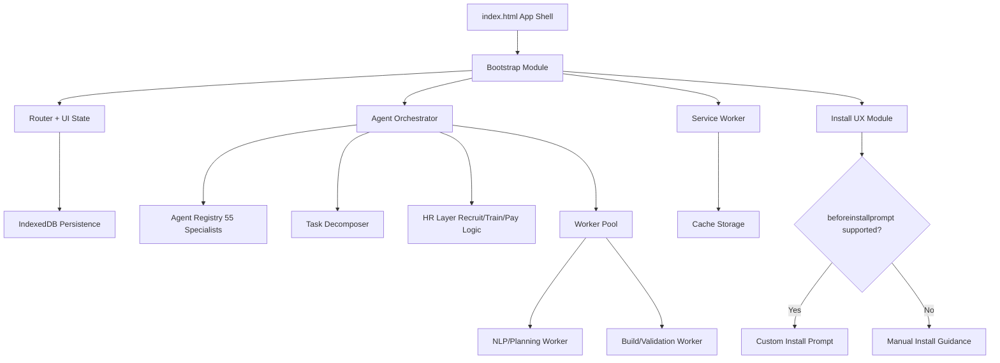

# QhySync AI PWA Architecture & Language Decision White Paper (April 1, 2026)

## Executive Summary

For your target system—an **offline-first PWA AI chat + AI agent operations platform** with modular ES modules, workers, and a growing codebase (45+ files now, eventually much larger)—the best option of your three choices is:

> **✅ Primary recommendation: TypeScript (TS) for logic + HTML for entry + separate CSS.**

TS/TSX/TS gives the strongest balance of:
- long-term maintainability for many files and teams,
- safer refactors as your 55-agent orchestration grows,
- robust module boundaries for non-monolithic design,
- compatibility with modern PWA patterns (service workers, workers, IndexedDB, manifest).

Plain JavaScript can still work, but carries higher risk at scale. HTML with large inline JavaScript is the weakest for this architecture because it tends to increase coupling and code fragility.

---

## 1) Problem Framing

You are not building a static site. You are building a **distributed client runtime** in the browser:
- agent routing/orchestration,
- chat UX,
- offline data/state,
- installation UX,
- background processing via workers,
- eventual custom language integration (`qhynlp-coding-language`).

That is effectively a software platform, not a simple webpage.

### Decision options compared
1. JavaScript (JS)
2. TypeScript/TSX/TS
3. HTML with inline JS + separate CSS

### Non-negotiable requirements you specified
- Offline-first PWA
- Modular build (no giant monolithic file)
- Production-ready app quality
- Index as entry point, ES modules/workers for composition
- Cross-browser install behavior awareness (Chrome, Safari, Opera, Firefox)

---

## 2) Scientific + Standards Evidence Base

### 2.1 Type systems and defect detection
A well-cited empirical study (“To Type or Not to Type”) found that static typing tools (Flow and TypeScript in that experiment) detected around **15% of public JavaScript bugs** in their benchmarked corpus. That is meaningful for large systems where bug volume and integration complexity scale with file count and team velocity.
- Source: Gao et al., ICSE (paper hosted by Microsoft Research PDF).

A newer 2026 empirical TypeScript ecosystem study reports that TypeScript reduces traditional runtime/type errors, but shifts some fragility to toolchains/build complexity. This is important: TS helps, but architecture and DevOps maturity remain mandatory.
- Source: arXiv 2601.21186.

### 2.2 PWA install and browser reality
The `beforeinstallprompt` event is **not baseline** and not universally supported across browsers.
- MDN explicitly marks limited availability.
- web.dev also warns not all browsers support it.

Therefore, your install strategy must be progressive:
1. Use event-driven install UX where supported.
2. Fall back to browser-specific manual install instructions where not supported.

### 2.3 PWA installability prerequisites
MDN installability guidance emphasizes:
- manifest inclusion,
- HTTPS/localhost,
- browser/platform-specific differences,
- installation UX varying by browser/OS.

This means language choice alone won’t make the PWA “install everywhere.” A standards-compliant install matrix and fallback UX is required.

### 2.4 Offline-first technical foundation
Service Workers are designed to intercept requests and support effective offline experiences via caching strategies, with install/activate lifecycle control.

This is crucial for your “autonomous AI chat app” requirement—especially if agents perform tasks while connectivity is intermittent.

---

## 3) Comparative Analysis of the 3 Options

## 3.1 Option A — JavaScript (JS)

**Strengths**
- Fast startup and low tooling friction.
- Native browser runtime; no compile step required.
- Good for prototypes and early velocity.

**Risks for your case**
- Harder to guarantee interface contracts across 55 specialist agents and orchestration layers.
- Refactors become riskier as files/modules grow.
- More runtime-only bug discovery unless supplemented with strict lint/test discipline.

**Verdict**
- Viable for small systems.
- For your scale and reliability goals, JS-only is second-best, not first-best.

---

## 3.2 Option B — TypeScript / TSX / TS

**Strengths**
- Static type checking catches classes of errors before runtime.
- Better API contracts between modules, workers, stores, and agent registries.
- Strong IDE tooling (navigation, autocomplete, safe refactor).
- Scales better for long-lived, multi-module products.
- TS is a superset of JS: incremental migration path exists.

**Risks / costs**
- Build pipeline complexity (transpile + bundling choices).
- Need conventions to avoid “type complexity debt.”
- Some defect categories move from runtime to configuration/toolchain (as recent empirical results suggest).

**Verdict**
- **Best strategic choice** for QhySync AI’s target architecture.

---

## 3.3 Option C — HTML with inline JS + separate CSS

**Strengths**
- Simple for small interactive pages.
- Quick to read in tiny apps.

**Risks for your case**
- Encourages tight coupling of structure and behavior.
- Harder dependency management and code isolation.
- Limits maintainability and testability for many-file modular systems.
- Increases monolithic drift risk (exactly what you want to avoid).

**Verdict**
- Not recommended for your production-scale modular PWA architecture.

---

## 4) Recommendation

## Final recommendation
Use **TypeScript + modular HTML/CSS/ESM** architecture:
- `index.html` = thin shell + bootstrapping.
- `src/**/*.ts` for app logic and orchestration.
- Web Workers / Service Worker in TS (compiled to JS).
- CSS separated and layered.
- No large inline script blocks.

### Why this directly matches your goals
- Reduces breakage risk as file count grows.
- Enables clean specialist-agent interfaces.
- Supports robust offline-first patterns.
- Keeps build modular, not monolithic.

---

## 5) Reference Architecture Blueprint (for your 55-agent agency)

### Suggested module segmentation
- `core/` (event bus, config, dependency injection)
- `agents/` (registry + specialist contracts)
- `orchestration/` (task routing, assignment policy)
- `hr/` (recruit/hire/train/pay QhyCoin rules)
- `storage/` (IndexedDB repositories, migrations)
- `pwa/` (manifest policy, install prompts, SW strategy)
- `ui/` (chat, dashboards, audit logs)
- `workers/` (CPU-heavy workflows)
- `security/` (authn/authz, key handling boundaries)

---

## 6) Browser Install Reality Check (Important)

### What is true as of this research snapshot
- `beforeinstallprompt` is limited/non-baseline.
- Desktop install promotion differs across Chromium/Safari/Firefox.
- On some platforms/browsers, manual install flows are required.

### Practical implementation rule
Treat install as **capability detection**, not assumption:
- If `beforeinstallprompt` exists, use custom prompt flow.
- Otherwise show contextual install help.
- Always maintain a usable “web mode” with no install requirement.

> **Did you know?** Even when install prompting is unavailable, many platforms still allow manual “Add to Home Screen” style installation. This keeps PWA reach high with proper fallback UX.

---

## 7) Risk Register and Mitigation

1. **Toolchain complexity risk (TS + bundling + workers).**
   - Mitigation: strict CI templates, locked tool versions, typed API boundaries.
2. **Agent orchestration sprawl across many modules.**
   - Mitigation: interface-first design (`AgentCapability`, `TaskContract`, `OutcomeSchema`).
3. **Offline consistency conflicts.**
   - Mitigation: deterministic sync policy, append-only event logs, conflict resolution rules.
4. **Install UX inconsistency by browser/platform.**
   - Mitigation: install strategy matrix + progressive enhancement.

---

## 8) Decision Matrix

| Criterion | JS | TS/TSX/TS | HTML + inline JS |
|---|---:|---:|---:|
| Scales with 45+ files to 100+ | 3/5 | **5/5** | 1/5 |
| Refactor safety | 2/5 | **5/5** | 1/5 |
| PWA/offline implementation robustness | 4/5 | **5/5** | 2/5 |
| Risk of becoming monolithic | 2/5 | **4/5** | 1/5 |
| Initial speed | **5/5** | 4/5 | 3/5 |
| Long-term maintainability | 3/5 | **5/5** | 1/5 |

**Winner: TS/TSX/TS (with modular architecture).**

---

## 9) Actionable Build Strategy (next phase, max 5 files at a time)

1. Start with `index.html` shell + strict module loader.
2. Add typed `app.bootstrap.ts` and `agent-orchestrator.ts`.
3. Add `install.ts` implementing capability detection and fallback UI.
4. Add service worker + offline cache policy.
5. Add `agent-registry.ts` with 55-agent schema (typed contracts first, behaviors second).

This sequence keeps each change-set robust and reviewable while matching your “5 files max” workflow.

---

## 10) Key Terms (Definitions)

- **PWA (Progressive Web App):** Web application with installability and app-like capabilities via standards such as manifest and service workers.
- **Service Worker:** Background script that can intercept network requests, manage caching, and enable offline behavior.
- **Web App Manifest:** JSON metadata describing install/display behavior (name, icons, start URL, display mode, etc.).
- **`beforeinstallprompt`:** Browser event (not universally supported) enabling custom install prompt flows.
- **Static Type Checking:** Compile-time analysis that validates value/type usage before execution.
- **Gradual Typing:** Strategy permitting incremental typing adoption in previously dynamic codebases.
- **ES Modules:** Standard JavaScript module system enabling explicit imports/exports and dependency boundaries.
- **Web Worker:** Background thread for computational tasks without blocking UI.

---

## 11) Sources (Reputable references)

1. MDN — Window: `beforeinstallprompt` event.  
   https://developer.mozilla.org/en-US/docs/Web/API/Window/beforeinstallprompt_event

2. MDN — Service Worker API.  
   https://developer.mozilla.org/en-US/docs/Web/API/Service_Worker_API

3. MDN — Making PWAs installable.  
   https://developer.mozilla.org/en-US/docs/Web/Progressive_web_apps/Guides/Making_PWAs_installable

4. web.dev — Installation prompt (PWA).  
   https://web.dev/learn/pwa/installation-prompt/

5. TypeScript Handbook — TypeScript for the New Programmer.  
   https://www.typescriptlang.org/docs/handbook/typescript-from-scratch.html

6. Gao et al. — *To Type or Not to Type: Quantifying Detectable Bugs in JavaScript* (ICSE).  
   https://www.microsoft.com/en-us/research/wp-content/uploads/2017/09/gao2017javascript.pdf

7. Li et al. (2026) — *From Logic to Toolchains: An Empirical Study of Bugs in the TypeScript Ecosystem* (arXiv:2601.21186).  
   https://arxiv.org/abs/2601.21186

---

## Bottom Line

For QhySync AI’s target system, **TypeScript (with modular ES architecture) is the highest-power, lowest-fragility option** among your three choices. Use HTML as a thin shell, keep CSS separate, and push logic into typed modules + workers.
